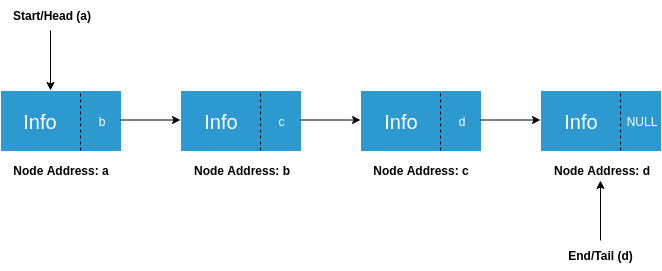

### Definition of Linked List
Linked list is a linear data structure where each data is a separate object (of same data type). Linked list objects do not occupy the contiguous memory location as compared to the array which is also a linear data structure where elements have contiguous memory allocation, instead linked lists are linked using pointers. Elements of the linked lists are known as Nodes.

There are three types of linked lists:

   - Singly Linked List
   - Doubly Linked List
   - Circular Linked List

### Concept of Linked list
<iframe src="https://www.youtube.com/embed/vQu-hXJZlYM" frameborder="0" allow="autoplay; encrypted-media" allowfullscreen></iframe>

### Need for linked list
**1. Memory Management:**
When you declare an array, the size of the array is fixed. You cannot change the size of the array. And there might be a case where you are not able to consume all the space that you have reserved as an array that means you are wasting a part of your memory or there might be a case where you have consumed all of the space that was reserved as an array and still you are not able to store your complete data. Linked List manages the memory efficiently. Size of the Linked list if flexible. Linked List consume only that much space which is required to store the data. Whenever a data is to be stored in the Linked List, linked list allocates the memory at the same time so we shouldn’t worry that our space may remain un-utilized. And whenever a data is deleted from the Linked List it frees the memory which was consumed by the deleting data and thus allows the memory to be reused, which is not possible with arrays.

**2. Faster Processing:**
To delete an element from an array we need to shift the elements of the array. In the worst case, suppose we have an array of size n. Now we want to delete the first element of the array that means we need to shift the (n-1) elements of the array to the left which have time complexity of O(n). Also we waste the memory that was occupied by the rightmost element. On the other hand, deleting an element from Linked List is quite simple, we just need to change the address hold by the two pointers which have O(1) time complexity. Also the memory occupied by this element can be freed so that it can be re-utilized.

### Single Linked List
Each Node of the singly list consists of two parts:

   - First part of the singly linked list Node contains the information to be stored.
   - Second part of the singly linked list Node contains the address of either its next Node or it previous Node and is a pointer.
   - **Head** is a pointer that store the address of the first Node of the list. **Tail** is also a pointer that holds the address of the last Node of the list.
   - Each Node of the singly linked list store the address of its next Node and in that way all the data of the singly linked list gets linked to each other.

### Representation of Linked List Experiment

### Data Type used in Singly Linked List

To implement a singly linked list we first need a data type( type of the data that is to be stored by the list).

Suppose we want to store the information of students where each student have a name, roll number as Singly Linked List.

Let us declare a structure named Node for this.
Our structure will contain the fields name, roll number, which will be the first part of the Node. Second part of the Node contains a pointer that holds the address of its next Node.
Example
struct Node{
// First part of the Node
// information that is to be stored
char name[50]; // name of the student
char rollNumber[10]; // roll number of the student
// second part of the Node
Node *next; // pointer holds the address of the next Node
};
### What is Linked List?

### Linked List vs Array

### Types of Linked List

### Operations on Linked list
<iframe src="https://www.youtube.com/embed/wyyYQF89pJ8" frameborder="0" allow="autoplay; encrypted-media" allowfullscreen></iframe>

