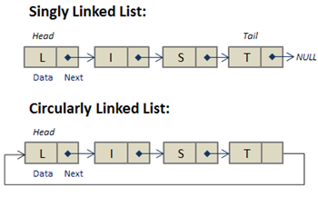

### Pictorial Representation of Singly Linked List vs Circular Linked List

### Insertion of elements into Circular Linked List

Insertion in circular linked list is similar to that of insertion in singly linked list, unlike next of the last element is pointed to head.
### Deletion of elements from Circular Linked List

There is no change in implementation of deletion of a node, it is similar to that of in singly linked list.

