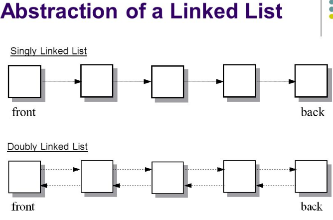

### Pictorial Representation of Singly Linked List vs Doubly Linked List 

### Insertion of elements into Doubly Linked List
Insertion in doubly linked list is similar to that of insertion in singly linked list, unlike there need to be a change in data type we use, we need to add an extra element to the data type, i.e; Node *parent, to store the address of the parent of a given node. The same has to be done while insetion, after creating a new element store the address of it's parent in the Node *parent variable.

### Deletion of elements from Doubly Linked List
There is no change in implementation of deletion of a node, it is similar to that of in singly linked list unlike parent of the child of deleted node must be added.

