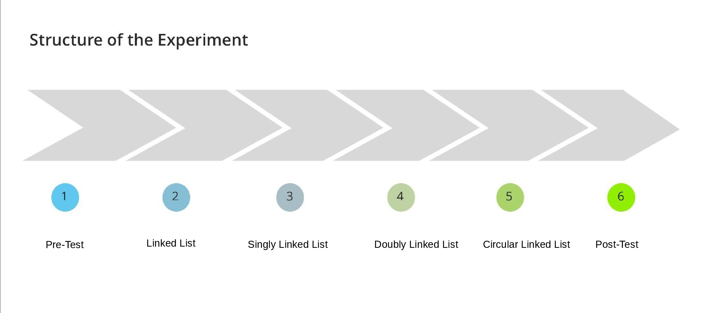

### Overview of the Experiment..!
<iframe src="https://www.youtube.com/embed/lMEvmsfV_dU" frameborder="0" allow="autoplay; encrypted-media" allowfullscreen></iframe>

### Prerequisites of the Experiment

- The learner is expected to know at least basics of following topics to understand experiment properly.
   - [Arrays](https://www.geeksforgeeks.org/introduction-to-arrays/)
   - [Structures](https://en.wikipedia.org/wiki/Struct_(C_programming_language))
   - [Pointers](https://www.studytonight.com/c/pointers-in-c.php)
   - [Basic Complexity Analysis](https://www.hackerearth.com/practice/basic-programming/complexity-analysis/time-and-space-complexity/tutorial/)
   - [Memory Representation](https://www.w3schools.in/difference-in-static-and-dynamic-memory-allocation/)
  <!-- - [Linked List Basics](https://www.cs.cmu.edu/~adamchik/15-121/lectures/Linked%20Lists/linked%20lists.html)-->

-    And above all, a curiosity to learn and explore..!

### Structure of the Experiment

