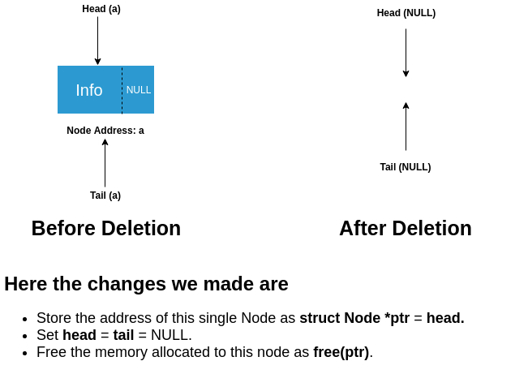
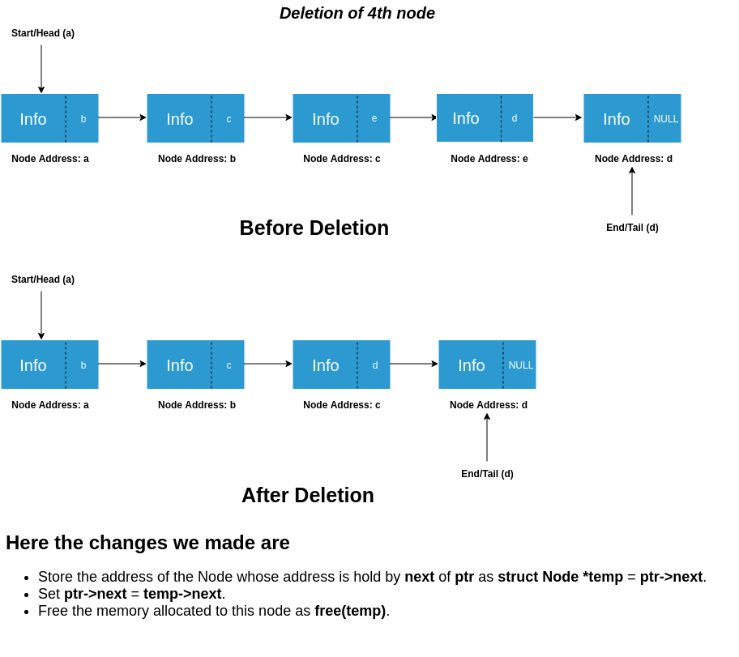
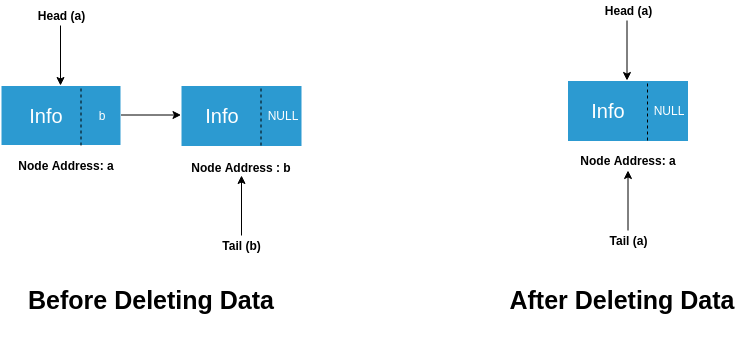

### Check

We can check whether the list is empty or not using something like this:

int isUnderflow(){
return start == NULL ? 1 : 0;
}

This function returns 1 if the list is empty, or returns 0 if the list is not empty.
### Deletion of elements from Singly Linked List

Three cases may arise when we want to insert data at the front.

**Case – 1** : When the list is empty i.e. head = NULL

Here, we don’t have to do anything because there is nothing that is to be deleted.

**Case – 2** : When list contains single entry i.e. head != NULL and head = tail.

**Case – 3** : When list contains two or more entries i.e. head != tail

   a. Deletion at Front
   b. Deletion of a Node (not at front)

### Deletion of node from Linked List (Case 2)

### Deletion of node from Linked List (Case 3a)

### Deletion of node from Linked List (Case 3b)

### Deletion of tail node from Linked List

