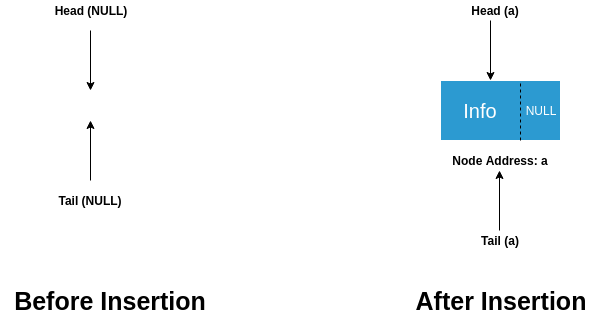
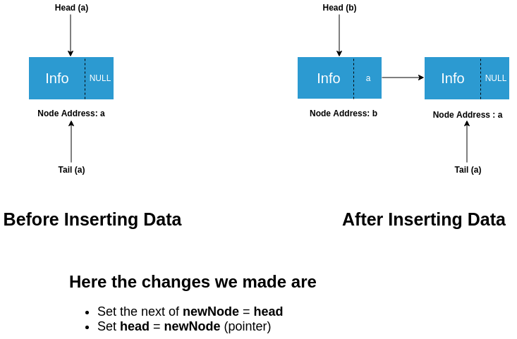
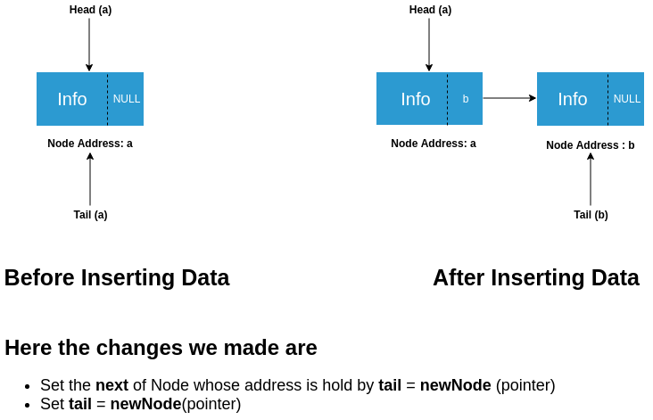
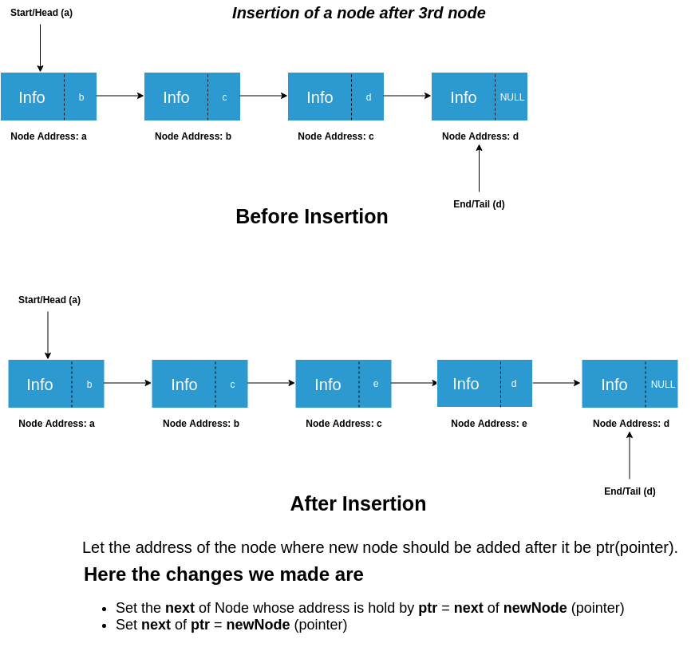
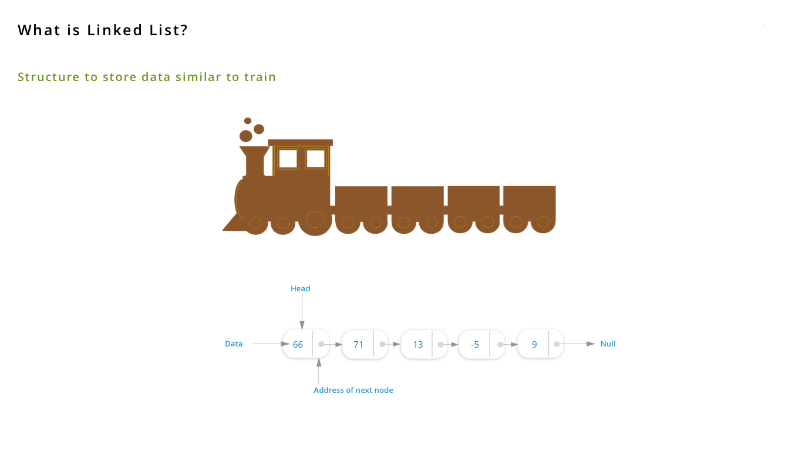

### Implementation of Singly Linked List

Now we have data type in our hand that our singly linked list is going to store.

Next we need two pointers that mark the start and end of our singly linked list. Let us declare them:

struct Node *head = NULL;
struct Node *tail = NULL;

We have initialized these pointers with null to indicate that they do not hold the address of any data yet i.e. no data has been stored in the list yet.

Now we are ready to insert the data in our singly linked list.
First we allocate memory to store data as:

struct Node *newNode = (Node*)malloc(sizeof(struct Node));
### Insertion of elements into Singly Linked List

Two cases may arise when we want to insert data at the front.

**Case – 1** : When the list is empty i.e. head = NULL

Here we can simply do head = tail = newNode(pointer)

**Case – 2** : When list contains some entries i.e. head != NULL

    Insertion at Front
    Insertion at End
    Insertion after a Node

### Insertion of node in Linked List (Case 1)

### Insertion of node in Linked List (Case 2a)
 
### Insertion of node in Linked List (Case 2b)
 
### Insertion of node in Linked List (Case 2c)
 
### Pictorial Representation of Linked List Experiment
 
